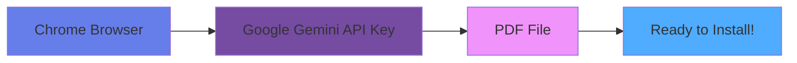
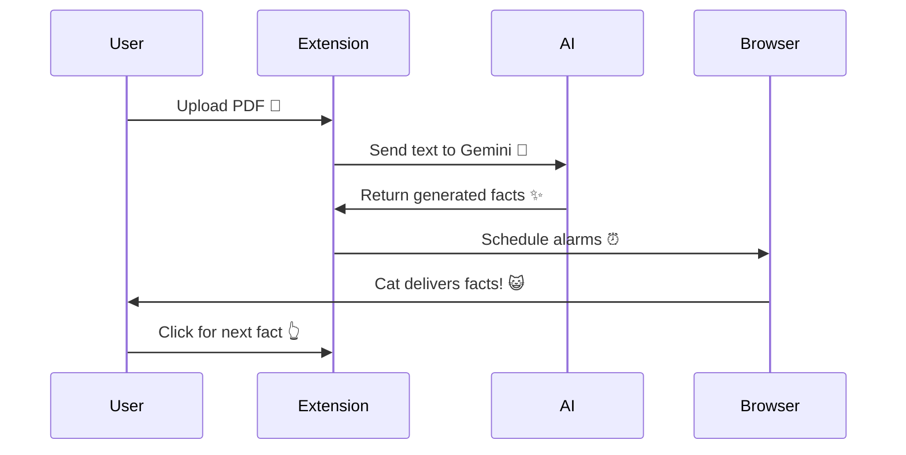

<div align="center">

# 😺 Mewoinfo - Purrfect PDF Facts


### 🌟 Upload a PDF and get meow-tastic facts delivered by a cute cat while you browse! 🐱📚

</div>

---

## 🎬 Demo

<div align="center">

```ascii
┌─────────────────────────────────────────┐
│  📄 Upload PDF → 🤖 AI Generates Facts  │
│                    ↓                     │
│         😺 Cat Delivers Facts!          │
│                    ↓                     │
│      🎉 Learn While You Browse 🌐       │
└─────────────────────────────────────────┘
```

</div>

---

## ✨ Features

<div align="center">

| Feature | Description | Icon |
|---------|-------------|------|
| **PDF Upload & Processing** | Extract text from PDFs using PDF.js library | 📄 |
| **AI-Powered Facts** | Generate interesting facts using Google Gemini API | 🤖 |
| **Cute Cat Animations** | Random cat GIFs deliver your facts with style | 🎨 |
| **Scheduled Notifications** | Set intervals for cat fact notifications | ⏰ |
| **Local Storage** | Store facts and settings securely | 💾 |
| **Easy Controls** | Intuitive popup interface for managing the extension | 🎯 |

</div>

---

## 🚀 Installation Guide

### 📋 Prerequisites

<div align="center">



</div>

**You'll Need:**
- ✅ Google Chrome/Chromium browser (v88+)
- ✅ Google Gemini API key ([Get it here](https://aistudio.google.com/app/apikey))
- ✅ A PDF file to process

---

### 📥 Step-by-Step Installation

<details open>
<summary><b>Step 1: Download the Extension</b> 📦</summary>

```bash
# Clone the repository
git clone https://github.com/C0D3K0NG/mewoinfo.git

# Navigate to the folder
cd mewoinfo
```

**OR** download the ZIP file and extract it to your desired location.

> 💡 **Tip:** Remember where you saved the folder!

</details>

<details open>
<summary><b>Step 2: Open Chrome Extensions</b> 🌐</summary>

1. Open Google Chrome
2. Type `chrome://extensions/` in the address bar
3. Press **Enter**

**OR**

1. Click the three dots (⋮) in the top-right corner
2. Go to **More tools** → **Extensions**

<div align="center">

```
Chrome Menu (⋮) → More Tools → Extensions
```

</div>

</details>

<details open>
<summary><b>Step 3: Enable Developer Mode</b> 🔧</summary>

1. Look for the **Developer mode** toggle in the top-right corner
2. Click to enable it (it should turn blue)

<div align="center">

```
┌────────────────────────────────┐
│ Developer mode    [ ON ]  🔵   │
└────────────────────────────────┘
```

</div>

> ⚠️ **Important:** Developer mode must be enabled to load unpacked extensions!

</details>

<details open>
<summary><b>Step 4: Load the Extension</b> 📂</summary>

1. Click the **Load unpacked** button (top-left area)
2. Navigate to the `mewoinfo` folder you downloaded
3. Select the folder and click **Select Folder** (or **Open**)

<div align="center">

```
Load unpacked → Select mewoinfo folder → Done! ✅
```

</div>

> ✨ You should now see the Mewoinfo extension in your extensions list!

</details>

<details open>
<summary><b>Step 5: Configure Your API Key</b> 🔑</summary>

1. Click the **Extensions** icon (puzzle piece) in Chrome toolbar
2. Find **Mewoinfo** and click on it to open the popup
3. Go to **Settings** section
4. Paste your **Google Gemini API key**
5. Set your preferred **interval** (1-60 minutes)
6. Click **Save Settings**

<div align="center">

```
🧩 Extensions → 😺 Mewoinfo → ⚙️ Settings → 🔑 Paste API Key
```

</div>

> 🎯 **Get your API key:** [Google AI Studio](https://aistudio.google.com/app/apikey)

</details>

<details open>
<summary><b>Step 6: Upload Your PDF</b> 📄</summary>

1. In the Mewoinfo popup, click **Upload PDF**
2. Select your PDF file from your computer
3. Wait for the upload to complete (you'll see a success message)

<div align="center">

```
Upload PDF 📄 → Select File → Wait for Processing ⏳ → Success! ✅
```

</div>

> 📝 **Note:** Make sure your PDF contains extractable text (not scanned images)

</details>

<details open>
<summary><b>Step 7: Generate Facts</b> 🎲</summary>

1. Click the **Generate Facts** button
2. Wait while the AI processes your PDF (this may take a few seconds)
3. You'll see a confirmation when facts are ready

<div align="center">

```
Generate Facts 🤖 → AI Processing... 🔄 → Facts Ready! 🎉
```

</div>

</details>

<details open>
<summary><b>Step 8: Enable & Enjoy!</b> 🎊</summary>

1. Toggle the **Enable Alarm** switch to ON
2. The cat will now deliver facts at your set interval!
3. Browse any website and wait for your first cat fact! 😺

<div align="center">

```
Enable Alarm ⏰ → Browse Web 🌐 → Cat Appears! 😺 → Learn Facts! 📚
```

</div>

> 🎉 **Congratulations!** You're all set up!

</details>

---

## 🎮 How to Use

<div align="center">

### Quick Start Workflow



</div>

### 🎯 Main Actions

| Action | How To | Result |
|--------|--------|--------|
| **Upload PDF** | Click "Upload PDF" button in popup | PDF text extracted and stored |
| **Generate Facts** | Click "Generate Facts" after upload | AI creates interesting facts |
| **Start Notifications** | Toggle "Enable Alarm" to ON | Cat facts appear automatically |
| **Change Interval** | Adjust slider in settings | Change how often facts appear |
| **Manual Next Fact** | Click the cat or bubble | Get next fact immediately |
| **Stop Notifications** | Toggle "Enable Alarm" to OFF | Stop automatic facts |

---

## 📁 Project Structure

```
mewoinfo/
├── 📄 manifest.json           # Extension configuration (Manifest V3)
├── 📖 README.md               # Documentation
│
├── 🎨 popup/                  # Extension popup UI
│   ├── popup.html             # Popup interface
│   ├── popup.js               # Popup logic & controls
│   └── popup.css              # Popup styling
│
├── ⚙️ scripts/                # Background & content scripts
│   ├── background.js          # Service worker (main logic)
│   ├── content.js             # Content script (runs on web pages)
│   ├── db.js                  # Chrome storage wrapper
│   └── gemini.js              # Google Gemini API integration
│
├── 💅 styles/                 # Stylesheets
│   └── content.css            # Animations & styling for cat widget
│
├── 📚 lib/                    # External libraries
│   ├── jspdf.umd.min.js       # PDF generation (optional)
│   ├── pdf.min.js             # PDF.js library
│   └── pdf.worker.min.js      # PDF.js worker
│
├── 🖼️ icons/                  # Extension icons
│   ├── icon16.png             # 16x16 icon
│   ├── icon48.png             # 48x48 icon
│   └── icon128.png            # 128x128 icon
│
└── 😺 cat_gifs/               # Cat GIF animations
    ├── cat0.gif               # Random cat animations
    ├── cat1.gif               # for delivering facts
    └── ... (up to cat9.gif)
```

---

## 🔧 Customization

### 🎨 Change Cat Animation Speed

Edit `styles/content.css`:

```css
#mewoinfo-container {
    animation: slideUp 0.6s cubic-bezier(...) forwards; 
    /* Change 0.6s to your preferred speed */
}
```

### 📍 Modify Widget Position

Edit `styles/content.css`:

```css
#mewoinfo-container {
    bottom: 20px;  /* Distance from bottom */
    right: 20px;   /* Distance from right */
}
```

### 😺 Add More Cats

1. Add more GIF files to `cat_gifs/` folder (cat10.gif, cat11.gif, etc.)
2. Update `background.js`:

```javascript
catIndex: Math.floor(Math.random() * 15)  // Change to number of cats
```

### ⏱️ Adjust Auto-Remove Timer

Edit `scripts/content.js`:

```javascript
autoRemoveTimer = setTimeout(() => {
    removeCat();
}, 30000); // Change milliseconds (30000 = 30 seconds)
```

---

## 🐛 Troubleshooting

<details>
<summary><b>😿 Cat not appearing?</b></summary>

- ✅ Check extension is enabled in `chrome://extensions/`
- ✅ Verify alarm is enabled in popup
- ✅ Make sure you're on a regular website (not chrome:// pages)
- ✅ Check browser console for errors (F12)
- ✅ Try refreshing the page

</details>

<details>
<summary><b>🔑 API key errors?</b></summary>

- ✅ Verify API key is valid from [Google AI Studio](https://aistudio.google.com/app/apikey)
- ✅ Check API quota hasn't been exceeded
- ✅ Ensure Gemini API is enabled for your project
- ✅ Try regenerating your API key

</details>

<details>
<summary><b>📄 PDF not loading?</b></summary>

- ✅ Try smaller PDF files first (under 10MB)
- ✅ Ensure PDF is text-based (not scanned image)
- ✅ Check browser console for errors
- ✅ Try a different PDF file

</details>

<details>
<summary><b>🤖 Facts not generating?</b></summary>

- ✅ Verify PDF has extractable text
- ✅ Check API key is correctly entered
- ✅ Ensure internet connection is stable
- ✅ Try clicking "Generate Facts" again
- ✅ Check console for error messages

</details>

---

## 🔐 Privacy & Security

<div align="center">

| Feature | Status | Description |
|---------|--------|-------------|
| **Local Storage** | ✅ Secure | All PDF data stored locally in browser |
| **No Server Storage** | ✅ Private | No data sent to external servers |
| **API Key Protection** | ✅ Encrypted | Stored securely in Chrome storage |
| **Limited Permissions** | ✅ Safe | Only runs on http/https pages |
| **No Tracking** | ✅ Anonymous | No user tracking or analytics |

</div>

---

## 📦 Dependencies

<div align="center">

| Library | Purpose | Version |
|---------|---------|---------|
| **pdf.js** | PDF text extraction | Latest |
| **Google Gemini API** | AI fact generation | v1.0 |
| **Chrome Extension APIs** | Extension functionality | MV3 |

</div>

---

## 🎯 Future Features

- [ ] 🎭 Multiple PDF support
- [ ] 📝 Custom fact templates
- [ ] 🔊 Voice narration for facts
- [ ] 🏷️ Fact filtering by category
- [ ] 🌙 Dark mode for widget
- [ ] 🦊 Firefox extension support
- [ ] 📊 Statistics dashboard
- [ ] 📢 Share facts functionality
- [ ] 🌍 Multi-language support
- [ ] 📱 Mobile browser support

---

## 📝 License

<div align="center">

**MIT License** - Feel free to fork and modify!

[](https://opensource.org/licenses/MIT)

</div>

---

## 🤝 Contributing

<div align="center">

**We love contributions!** 💖

```
Fork 🍴 → Create Branch 🌿 → Make Changes ✨ → Submit PR 🚀
```

</div>

Have ideas? Found a bug?

1. 🍴 Fork the repository
2. 🌿 Create a feature branch (`git checkout -b feature/AmazingFeature`)
3. ✨ Make your changes
4. 💾 Commit your changes (`git commit -m 'Add some AmazingFeature'`)
5. 📤 Push to the branch (`git push origin feature/AmazingFeature`)
6. 🚀 Submit a pull request

---

## 👨‍💻 Author

<div align="center">

**C0D3K0NG**

[](https://github.com/C0D3K0NG)

*Made with ❤️ and lots of meows*

</div>

---

## ⭐ Support the Project

<div align="center">

If you find this extension helpful, please consider:

⭐ **Star this repository**  
🐛 **Report bugs**  
💡 **Suggest features**  
📢 **Share with friends**


### **Happy learning with your purrfect cat! 😺📚**

</div>

---

<div align="center">


**✨ Made with passion and cat magic ✨**

</div>
